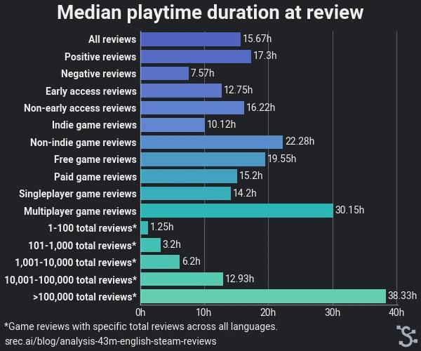

# Analysis of 43 million English Steam Reviews 

| Original blog link | https://srec.ai/blog/analysis-43m-english-steam-reviews                                                   |
| ------------------ | ----------------------------------------------------------------------------------------------------------------- |
| Description        | An analysis of English Steam Review based on SRec database snapshot which was taken on 21 February 2024. |
| Published time     | 23 March 2024                                                                                                     |
| Section            | Steam                                                                                                             |
| Tags               | Steam Reviews, Data analytic, Statistic, Machine Learning                                                         |

**Notice:** If you use mobile device, I **recommend** you to read this blog in a horizontal position.

In the previous blog post, [I briefly analyzed 118 million reviews](https://srec.ai/blog/brief-analysis-118m-steam-reviews). This time, I performed an analysis on all English Steam reviews. Some analysis aspect or dimension shown in this blog post follows an empirical study done by Dayi et al. While Dayi et al. performed an empirical study on 10,954,956 reviews on all languages across 6,224 games, this analysis was done on 43,845,837 reviews on filtered English language across 75,732 games.

## Table of contents

- [Analysis of 43 million English Steam Reviews](#analysis-of-43-million-english-steam-reviews)
  - [Table of contents](#table-of-contents)
  - [English Steam Review](#english-steam-review)
  - [Types of analyzed reviews](#types-of-analyzed-reviews)
  - [Positive negative distribution](#positive-negative-distribution)
  - [Review length](#review-length)
  - [Review complexity](#review-complexity)
  - [Playtime duration at review](#playtime-duration-at-review)
  - [Review aspect](#review-aspect)
  - [Conclusion](#conclusion)
  - [Appendix A - Language model training](#appendix-a---language-model-training)
  - [Appendix B - Additional statistics](#appendix-b---additional-statistics)
- [References](#references)

## English Steam Review

The source of 43,845,837 English Steam reviews comes from a snapshot of the SRec database, which was taken on 21 February 2024. All review text was preprocessed by stripping BBcode, reducing excessive whitespaces and reducing excessive newlines. Initially, there were 56,212,172 reviews marked as English, but the total reviews were reduced with 2 filterings:

1. Exclude review which has less than 50% of the English alphabet.
2. Using FastText language identification model to exclude review which isn't detected as English as the primary language or have less than 40% confidence.

## Types of analyzed reviews

In this blog, I split English reviews into multiple dimensions. The goal is to analyze whether the type of game or review has impact on user's review behavior. Here are the 7 dimensions:

1. **All reviews.**
2. **Positive and negative reviews.**
3. **Early access reviews & non-early access reviews.**
4. **Indie and non-indie game reviews**. A game is classified as an Indie game if the developer sets "Indie" as the game's genre or "Indie" game tag is in the top 50% of game tags.
5. **Free and paid game reviews.** Free-to-play games (e.g. "CS2" and "Warframe") are classified as free games.
6. **Singleplayer and multiplayer game reviews**. A game is classified as singleplayer game if the developer includes "Single-player" category and doesn't include any multiplayer category (e.g. "Online PvP" and "Cross-platform multiplayer"). In case both category exists, I check whether "Singleplayer" game tags have a higher position than one of the multiplayer game tags (e.g. "Online Co-Op", "PvP").
7. **Reviews based on the game's total reviews**. By total reviews, it refers to the total of all reviews across all languages. I split total reviews into 5 bins, which are 1-100, 101-1,000, 1,001-10,000, 10,001-100,000 and >100,000 total reviews.

## Positive negative distribution

**Indie, paid and singleplayer game reviews have more positive reviews than their counterparts.** It may indicate player who buy paid games do more research about games they bought. The same indication can be applied to singleplayer and Indie games since those usually are also paid games. However it's also possible that people are more forgiving when reviewing Indie games.

**Game with fewer total reviews is more likely to have more negative reviews.** It indicates games with fewer total reviews usually have lower quality or offer less enjoyment.

**Early access review and its counterpart have a roughly similar distribution.** This is unexpected since there is some stigma revolving around early access games. It's possible people who play early access games are either more forgiving when reviewing game during early access phase or decide not to write a review before the game comes out of early access phase.

## Review length

**English reviews have a median of 91 characters.** The average character per word in English is 5 to 6.5 characters including whitespaces and punctations, which means English review have a median of 14 to 18.2 words. In addition, the median of median characters for each game is 191 characters. The lowest median belongs to [Aventura Copilului Albastru și Urât](https://srec.ai/app/1530140) with a median of 22.5 characters and 190 English reviews, whereas longest median belongs to [Aquadine](https://srec.ai/app/1275150) with a median of 2125 characters and 27 English reviews. 

**Negative reviews are about 2 times longer than positive reviews.** This is also an unexpected finding since research done by Dayi et al. found negative reviews are only slightly longer than positive ones. This difference may be caused we analyzed more reviews across more games. One possible explanation for this finding is someone is more likely to write a more detailed negative review hoping the developer to make improvements or prevent interested players from playing the game without knowing the shortcomings.

**Early access and indie game reviews are slightly longer than their counterparts.** This indicates players are more likely to give more detailed reviews for both early access and Indie games.

**Paid game reviews are about 50% longer than free game reviews.** One possible explanation is players feel more invested with the game they paid for. Another reason might be players also talk about whether the paid game is worth the price.

**Game with fewer total reviews are far longer than its counterparts.** This indicates with fewer total reviews, someone is more likely to write a detailed review in order to help the interested players. It's also possible that less popular games attract small but enthusiastic players. 

## Review complexity

> Table 1. Example of reviews with various CLI values

| Review Text                                                                                                                                                                 | CLI value | Description              |
| --------------------------------------------------------------------------------------------------------------------------------------------------------------------------- | --------- | ------------------------ |
| Great game!  Love the story.                                                                                                                                                | 2.64      | A review with low CLI    |
| Girl I liked got me this game for christmas before I was turned down, experiencing sadness and then happiness after seeing a cute dog in the game made my week better 10/10 | 8.31      | A review with medium CLI |
| sweet, inventive, adorable and compelling narrative puzzle-lite. reminds me of some of my favorite short manga or childrens books. absolutely worth the time!               | 12.89     | A review with high CLI   |

Following Dayi et al., I also utilize Coleman–Liau index (CLI) to estimate the complexity of the reviews. CLI is a simple formula to estimate the U.S. grade level required to read and understand a given text. CLI utilizes average number of letters and sentences per 100 words. Higher CLI indicates text is harder to read and understand & vice versa.

**Reviews have a median readability level of between U.S. grade 6 and 7.** The median of all reviews has a value of 6.44, with Q1 4.28 and Q3 8.44. In addition, the median distribution across all review dimensions is mostly consistent, where the lowest one has a readability level of U.S. grade 6 and the highest one has a readability level of U.S. grade 7.

## Playtime duration at review

**Reviews have a median of 15.67 hours of playing time.** In addition, it has Q1 of 4.63 hours and Q3 of 60.03 hours. It indicates a quarter of the review within the first 4.64 hours and half of the review written within the first 15.67 hours.

**Negative, indie game and singleplayer game reviews are posted only after about half playtime of their counterparts.** It's likely indie and singleplayer game reviews have playtime due to shorter content or less replayability. However it doesn't deny the possibility that people who play indie or singleplayer games willing to less spend time.

**Game's total reviews greatly affect how long someone plays before posting a review.** It indicates less popular games usually have less content or replayability. But since less popular games have more negative reviews percentage, it also indicated games with fewer usually have lower quality. 

## Review aspect

In this section, I analyze which aspects are mentioned in English reviews. I trained a language model on a small dataset labeled by myself and performed predictions on all 43.8 million reviews. Additional details about this procedure can be seen in Appendix A. Table 2 shows which aspect predicted from the reviews along with a short description and example taken from the dataset. **Take note** that each aspect may also talk about the lack of the aspect itself (e.g. review that state they never encountered any bug).

> Table 2. Example of reviews which mention certain game aspect

| Aspect    | Short description                                                                                      | Review text                                                                                                                    |
| --------- | ------------------------------------------------------------------------------------------------------ | ------------------------------------------------------------------------------------------------------------------------------ |
| Story     | Story, character, lore, world-building, etc.                                                           | Excellent game, but has an awful-abrupt ending that comes out of nowhere and doesnt make sense ...                             |
| Gameplay  | Controls, mechanics, interactivity, difficulty, etc.                                                   | Gone are the days of mindless building and fun. Power grids? Taxes? Intense accounting and counter-intuitive path building ... |
| Visual    | Graphics quality, art style, animation, visual effects, etc.                                           | Gorgeous graphics + 80s\/90s anime artstyle + Spooky + Atmospheric ...                                                         |
| Audio     | Sound design, music, voice acting and other auditory elements.                                         | ... catchy music, wonderful narrator saying very kind words ...                                                                |
| Technical | The technical aspects of the game such as bug, performance, OS support, controller support and others. | bad doesnt fit a 1080p monitor u bastard ...                                                                                   |
| Price     | Price of the game or it\'s additional content.                                                         | Devs are on meth pricing this game at $44                                                                                      |

**43.67% of reviews may provide useful information**. 46.37% comes from the total of predicted reviews which mention at least one aspect. The term "may" is used here since a review might only say few words for certain aspects (e.g. "good story").

**Negative, singleplayer game and paid game reviews mention more aspects of the game than their counterparts.** Negative reviews also mention technical aspect 5 times and price aspect 6 times more frequently compared with positive reviews. This is another indicator that negative reviews usually contain more information and people feel more invested in paid games.

**Reviews for games with fewer total reviews usually contain more information.** This is a further indicator that with fewer total reviews, someone is more likely to write a detailed review. This is especially true for the visual and audio aspects of the game.

## Conclusion

Despite the negative perception of Steam user reviews, it's possible to extract some insight after some filtering. In this blog post, I've analyzed 43.8 million English reviews on various hindsight. The most interesting findings are,

1. Games with fewer total reviews usually are longer and contain more information.
2. Negative reviews are posted within half of the playtime of positive reviews, but usually are longer and contain more information.
3. Indie games are more likely to receive positive reviews with more information.

With this analysis, I hope developers pay more attention to all reviews and interested players also read negative reviews. In addition, I hope researcher will be encouraged to perform in-depth study/analysis using all reviews.

## Appendix A - Language model training

To identify what gamers talking about, I labeled 1100 reviews by myself and trained them with a transformer-based language model. I perform iterative stratification in order to split the dataset into 900 and 200. There are 7 labels labeled by me, including label "suggestion". However it's not included in the analysis due to poor test results.

> Table 3. Dataset label statistics

| Label       | Train | Test |
| ----------- | ----- | ---- |
| Recommended | 667   | 148  |
| Story       | 400   | 89   |
| Gameplay    | 693   | 154  |
| Visual      | 391   | 87   |
| Audio       | 227   | 51   |
| Technical   | 259   | 57   |
| Money       | 213   | 47   |
| Suggestion  | 97    | 21   |

Due to limited computing resources, I decided to choose `jina-embeddings-v2-base-en` which has a small amount of parameter, but supports 8K token length. I perform pruning by keeping only the 4 first encoder layers. In addition, I use `Torch-Pruning` library to remove 8 out of 12 attention heads and 60% parameters which exclude Embedding, Pooler, Classifier and each encoder's MLP gated layers. I exclude the encoder's MLP gated layers since it's not supported by `Torch-Pruning`.

> Table 4. Test result on the dataset

| Model                               | Param (M) | Attention heads | Accuracy | Precision | Recall | F1    |
| ----------------------------------- | --------- | --------------- | -------- | --------- | ------ | ----- |
| jina-embeddings-v2-small-en         | 33M       | 8               | 0.789    | 0.761     | 0.705  | 0.732 |
| jina-embeddings-v2-base-en          | 137M      | 12              | 0.855    | 0.845     | 0.791  | 0.817 |
| jina-embeddings-v2-base-en (pruned) | 56M       | 4               | 0.793    | 0.755     | 0.731  | 0.743 |

Compared with `jina-embeddings-v2-small-en`, the pruned model has slightly better inference speed on RTX 3060 with BF16 precision. The test result is also slightly better, although it's not as great as I hoped. After looking at the test results on various pruning configurations, i trained the final model with both train and test data.

## Appendix B - Additional statistics

**Notice:** I strongly recommend you read this appendix on either a desktop or mobile device with a big screen and resolution in a horizontal position.

> Table 5. Total reviews by each review dimensions

| Review dimension             | Total reviews | Total positive reviews | Total negative reviews |
| ---------------------------- | ------------- | ---------------------- | ---------------------- |
| All reviews                  | 43,845,837    | 36,922,643 (84.16%)    | 6,923,194 (15.84%)     |
| Early access reviews         | 5,768,322     | 4,854,826 (84.16%)     | 913,496 (15.84%)       |
| Non-early access reviews     | 38,077,515    | 32,067,817 (84.22%)    | 6,009,698 (15.78%)     |
| Indie game reviews           | 19,190,643    | 16,749,594 (87.28%)    | 2,441,049 (12.72%)     |
| Non-Indie game reviews       | 24,655,194    | 20,173,049 (81.82%)    | 4,482,145 (18.18%)     |
| Free game reviews            | 8,376,303     | 6,701,372 (80.0%)      | 1,674,931 (20.0%)      |
| Paid game reviews            | 35,469,534    | 30,167,482 (85.21%)    | 5,237,278 (14.79%)     |
| Singleplayer game reviews    | 36,080,867    | 30,897,478 (85.63%)    | 5,183,389 (14.37%)     |
| Multiplayer game reviews     | 7,764,970     | 6,025,165 (77.59%)     | 1,739,805 (22.41%)     |
| 1-100 total reviews          | 658,086       | 484,183 (73.57%)       | 173,903 (26.43%)       |
| 101-1,000 total reviews      | 2,358,337     | 1,802,146 (76.42%)     | 556,191 (23.58%)       |
| 1,001-10,000 total reviews   | 7,213,354     | 5,862,110 (81.27%)     | 1,351,244 (18.73%)     |
| 10,001-100,000 total reviews | 14,585,402    | 12,272,101 (84.14%)    | 2,313,301 (15.86%)     |
| >100,000 total reviews       | 19,030,658    | 16,502,103 (86.71%)    | 2,528,555 (13.29%)     |

> Table 6. CLI value by each review dimensions

| Review dimension             | Q1   | Q2/median | Q3   | Average/mean | Standard deviation |
| ---------------------------- | ---- | --------- | ---- | ------------ | ------------------ |
| All reviews                  | 4.28 | 6.44      | 8.44 | 6.52         | 3.25               |
| Positive reviews             | 4.16 | 6.32      | 8.41 | 6.45         | 3.31               |
| Negative reviews             | 4.97 | 6.8       | 8.48 | 6.82         | 2.94               |
| Early access reviews         | 4.35 | 6.38      | 8.25 | 6.46         | 3.11               |
| Non-early access reviews     | 4.28 | 6.45      | 8.45 | 6.53         | 3.27               |
| Indie game reviews           | 4.34 | 6.49      | 8.5  | 6.59         | 3.26               |
| Non-Indie game reviews       | 4.21 | 6.37      | 8.37 | 6.46         | 3.25               |
| Free game reviews            | 3.78 | 5.93      | 8.01 | 6.1          | 3.27               |
| Paid game reviews            | 4.35 | 6.55      | 8.5  | 6.61         | 3.24               |
| Singleplayer game reviews    | 4.35 | 6.54      | 8.5  | 6.61         | 3.25               |
| Multiplayer game reviews     | 3.77 | 5.91      | 7.94 | 6.07         | 3.24               |
| 1-100 total reviews          | 5.34 | 7.13      | 8.88 | 7.19         | 2.96               |
| 101-1,000 total reviews      | 5.04 | 6.96      | 8.71 | 7.0          | 3.02               |
| 1,001-10,000 total reviews   | 4.78 | 6.78      | 8.64 | 6.82         | 3.12               |
| 10,001-100,000 total reviews | 4.35 | 6.52      | 8.48 | 6.6          | 3.23               |
| >100,000 total reviews       | 3.8  | 6.06      | 8.18 | 6.22         | 3.34               |

> Table 7. Character length by each review dimensions

| Review dimension             | Q1  | Q2/median | Q3  | Average/mean | Standard deviation |
| ---------------------------- | --- | --------- | --- | ------------ | ------------------ |
| All reviews                  | 36  | 91        | 264 | 282.56       | 600.44             |
| Positive reviews             | 33  | 81        | 228 | 250.53       | 550.6              |
| Negative reviews             | 65  | 182       | 487 | 453.42       | 794.89             |
| Early access reviews         | 42  | 106       | 293 | 293.56       | 576.18             |
| Non-early access reviews     | 35  | 89        | 259 | 280.9        | 604.02             |
| Indie game reviews           | 38  | 97        | 273 | 284.43       | 584.94             |
| Non-Indie game reviews       | 34  | 87        | 256 | 281.11       | 612.23             |
| Free game reviews            | 27  | 64        | 175 | 201.3        | 470.25             |
| Paid game reviews            | 39  | 99        | 287 | 301.89       | 625.92             |
| Singleplayer game reviews    | 38  | 99        | 284 | 298.98       | 621.4              |
| Multiplayer game reviews     | 26  | 64        | 177 | 206.28       | 484.24             |
| 1-100 total reviews          | 92  | 233       | 571 | 528.78       | 860.54             |
| 101-1,000 total reviews      | 70  | 191       | 492 | 457.99       | 786.96             |
| 1,001-10,000 total reviews   | 54  | 142       | 387 | 377.22       | 702.66             |
| 10,001-100,000 total reviews | 40  | 102       | 287 | 299.88       | 617.44             |
| >100,000 total reviews       | 27  | 64        | 174 | 203.16       | 482.83             |

> Table 8. Median playtime (in hours) by each review dimensions

| Review dimension             | Q1    | Q2/median | Q3     | Average/mean | Standard deviation |
| ---------------------------- | ----- | --------- | ------ | ------------ | ------------------ |
| All reviews                  | 4.63  | 15.67     | 60.03  | 126.2        | 495.8              |
| Positive reviews             | 5.45  | 17.3      | 62.75  | 124.0        | 478.57             |
| Negative reviews             | 1.38  | 7.57      | 42.6   | 137.93       | 579.16             |
| Early access reviews         | 4.13  | 12.75     | 41.05  | 67.02        | 280.81             |
| Non-early access reviews     | 4.72  | 16.22     | 64.05  | 135.17       | 520.12             |
| Indie game reviews           | 3.35  | 10.12     | 36.95  | 81.6         | 371.95             |
| Non-Indie game reviews       | 6.6   | 22.28     | 83.13  | 160.94       | 571.65             |
| Free game reviews            | 3.32  | 19.55     | 175.7  | 293.42       | 843.09             |
| Paid game reviews            | 4.93  | 15.2      | 50.92  | 86.66        | 357.47             |
| Singleplayer game reviews    | 4.43  | 14.2      | 49.33  | 88.67        | 371.72             |
| Multiplayer game reviews     | 6.12  | 30.15     | 194.77 | 300.35       | 841.75             |
| 1-100 total reviews          | 0.4   | 1.25      | 3.87   | 7.53         | 124.25             |
| 101-1,000 total reviews      | 0.92  | 3.2       | 8.87   | 17.61        | 174.77             |
| 1,001-10,000 total reviews   | 2.03  | 6.2       | 17.68  | 33.77        | 259.4              |
| 10,001-100,000 total reviews | 4.58  | 12.93     | 37.8   | 65.67        | 351.58             |
| >100,000 total reviews       | 10.92 | 38.33     | 149.6  | 224.89       | 650.79             |

> Table 9. Aspect mentioned in reviews with 50% confidence

| Review dimension             | Story  | Gameplay | Visual | Audio  | Technical | Price  | Review with at least 1 aspect |
| ---------------------------- | ------ | -------- | ------ | ------ | --------- | ------ | ----------------------------- |
| All reviews                  | 14.04% | 39.3%    | 13.39% | 5.38%  | 6.99%     | 3.3%   | 43.67%                        |
| Positive reviews             | 14.63% | 37.48%   | 13.14% | 5.54%  | 4.21%     | 1.81%  | 41.31%                        |
| Negative reviews             | 10.91% | 49.01%   | 14.75% | 4.51%  | 21.86%    | 11.26% | 56.26%                        |
| Early access reviews         | 6.05%  | 42.66%   | 11.38% | 3.36%  | 9.25%     | 4.07%  | 45.33%                        |
| Non-early access reviews     | 15.25% | 38.79%   | 13.7%  | 5.69%  | 6.65%     | 3.18%  | 43.42%                        |
| Indie game reviews           | 14.14% | 41.38%   | 14.81% | 6.88%  | 5.43%     | 2.43%  | 45.58%                        |
| Non-Indie game reviews       | 13.97% | 37.69%   | 12.29% | 4.21%  | 8.21%     | 3.98%  | 42.19%                        |
| Free game reviews            | 6.82%  | 29.02%   | 7.59%  | 2.68%  | 6.24%     | 3.04%  | 32.67%                        |
| Paid game reviews            | 15.75% | 41.73%   | 14.76% | 6.02%  | 7.17%     | 3.36%  | 46.27%                        |
| Singleplayer game reviews    | 16.4%  | 41.62%   | 14.94% | 6.16%  | 6.71%     | 3.14%  | 46.33%                        |
| Multiplayer game reviews     | 3.1%   | 28.54%   | 6.23%  | 1.76%  | 8.29%     | 4.05%  | 31.31%                        |
| 1-100 total reviews          | 22.11% | 64.94%   | 28.98% | 13.81% | 11.21%    | 4.53%  | 70.46%                        |
| 101-1,000 total reviews      | 22.27% | 58.06%   | 24.38% | 11.29% | 9.37%     | 3.95%  | 64.0%                         |
| 1,001-10,000 total reviews   | 20.04% | 50.82%   | 19.73% | 8.92%  | 7.93%     | 3.54%  | 56.25%                        |
| 10,001-100,000 total reviews | 16.7%  | 42.11%   | 14.54% | 5.76%  | 7.48%     | 3.59%  | 47.2%                         |
| >100,000 total reviews       | 8.43%  | 29.57%   | 8.21%  | 2.72%  | 5.82%     | 2.86%  | 32.75%                        |

> Table 10. Aspect mentioned in reviews with 70% confidence (number inside bracket shows difference compared with 50% confidence)

| Review dimension             | Story           | Gameplay         | Visual          | Audio           | Technical        | Price           | Review with at least 1 aspect |
| ---------------------------- | --------------- | ---------------- | --------------- | --------------- | ---------------- | --------------- | ----------------------------- |
| All reviews                  | 11.1% (-2.94%)  | 25.47% (-13.83%) | 10.33% (-3.06%) | 4.72% (-0.66%)  | 3.03% (-3.96%)   | 0.3% (-3.0%)    | 31.89% (-11.78%)              |
| Positive reviews             | 11.56% (-3.07%) | 24.12% (-13.36%) | 10.12% (-3.02%) | 4.9% (-0.64%)   | 1.65% (-2.56%)   | 0.13% (-1.68%)  | 30.27% (-11.04%)              |
| Negative reviews             | 8.65% (-2.26%)  | 32.65% (-16.36%) | 11.47% (-3.28%) | 3.72% (-0.79%)  | 10.39% (-11.47%) | 1.22% (-10.04%) | 40.53% (-15.73%)              |
| Early access reviews         | 4.01% (-2.04%)  | 27.91% (-14.75%) | 9.03% (-2.35%)  | 2.8% (-0.56%)   | 3.98% (-5.27%)   | 0.37% (-3.7%)   | 31.12% (-14.21%)              |
| Non-early access reviews     | 12.17% (-3.08%) | 25.1% (-13.69%)  | 10.53% (-3.17%) | 5.01% (-0.68%)  | 2.88% (-3.77%)   | 0.29% (-2.89%)  | 32.01% (-11.41%)              |
| Indie game reviews           | 11.04% (-3.1%)  | 27.01% (-14.37%) | 11.3% (-3.51%)  | 6.09% (-0.79%)  | 2.17% (-3.26%)   | 0.21% (-2.22%)  | 33.49% (-12.09%)              |
| Non-Indie game reviews       | 11.14% (-2.83%) | 24.27% (-13.42%) | 9.58% (-2.71%)  | 3.65% (-0.56%)  | 3.69% (-4.52%)   | 0.38% (-3.6%)   | 30.65% (-11.54%)              |
| Free game reviews            | 5.11% (-1.71%)  | 17.09% (-11.93%) | 5.74% (-1.85%)  | 2.25% (-0.43%)  | 2.61% (-3.63%)   | 0.3% (-2.74%)   | 21.36% (-11.31%)              |
| Paid game reviews            | 12.51% (-3.24%) | 27.44% (-14.29%) | 11.42% (-3.34%) | 5.3% (-0.72%)   | 3.13% (-4.04%)   | 0.31% (-3.05%)  | 34.38% (-11.89%)              |
| Singleplayer game reviews    | 13.07% (-3.33%) | 27.29% (-14.33%) | 11.53% (-3.41%) | 5.44% (-0.72%)  | 2.88% (-3.83%)   | 0.28% (-2.86%)  | 34.53% (-11.8%)               |
| Multiplayer game reviews     | 1.93% (-1.17%)  | 16.99% (-11.55%) | 4.78% (-1.45%)  | 1.38% (-0.38%)  | 3.72% (-4.57%)   | 0.41% (-3.64%)  | 19.65% (-11.66%)              |
| 1-100 total reviews          | 17.26% (-4.85%) | 48.51% (-16.43%) | 22.57% (-6.41%) | 12.08% (-1.73%) | 4.43% (-6.78%)   | 0.39% (-4.14%)  | 57.48% (-12.98%)              |
| 101-1,000 total reviews      | 17.9% (-4.37%)  | 41.39% (-16.67%) | 18.9% (-5.48%)  | 9.93% (-1.36%)  | 3.71% (-5.66%)   | 0.34% (-3.61%)  | 50.94% (-13.06%)              |
| 1,001-10,000 total reviews   | 16.06% (-3.98%) | 34.74% (-16.08%) | 15.16% (-4.57%) | 7.9% (-1.02%)   | 3.25% (-4.68%)   | 0.32% (-3.22%)  | 43.41% (-12.84%)              |
| 10,001-100,000 total reviews | 13.39% (-3.31%) | 27.32% (-14.79%) | 11.23% (-3.31%) | 5.07% (-0.69%)  | 3.3% (-4.18%)    | 0.34% (-3.25%)  | 34.95% (-12.25%)              |
| >100,000 total reviews       | 6.4% (-2.03%)   | 17.76% (-11.81%) | 6.33% (-1.88%)  | 2.34% (-0.38%)  | 2.6% (-3.22%)    | 0.27% (-2.59%)  | 21.94% (-10.81%)              |

# References

1. [(PDF) An Empirical Study of Game Reviews on the Steam Platform](https://www.researchgate.net/publication/324923032_An_Empirical_Study_of_Game_Reviews_on_the_Steam_Platform)
2. [Language identification · fastText](https://fasttext.cc/docs/en/language-identification.html)
3. [[2310.19923] Jina Embeddings 2: 8192-Token General-Purpose Text Embeddings for Long Documents](https://arxiv.org/abs/2310.19923)
4. [[2004.03844] On the Effect of Dropping Layers of Pre-trained Transformer Models](https://arxiv.org/abs/2004.03844)
5. [VainF/Torch-Pruning: [CVPR 2023] Towards Any Structural Pruning; LLMs / SAM /  Diffusion / Transformers / YOLOv8 / CNNs](https://github.com/VainF/Torch-Pruning/)
6. [A computer readability formula designed for machine scoring.](https://psycnet.apa.org/record/1975-22007-001)