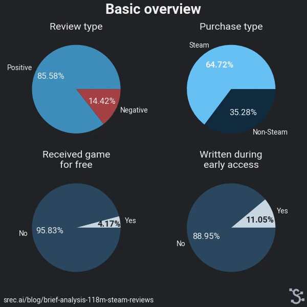
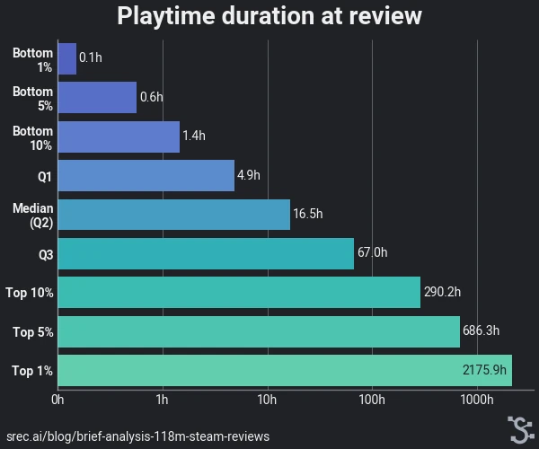
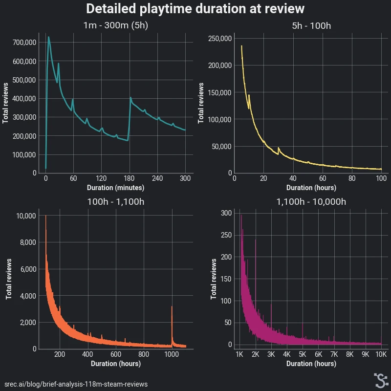
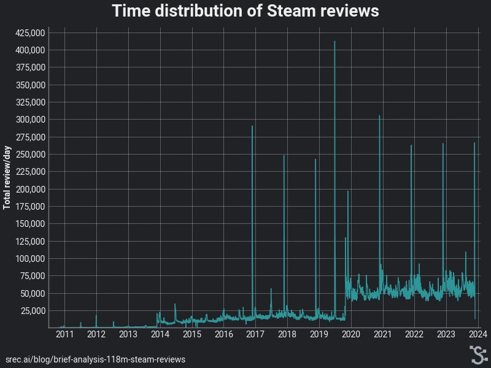
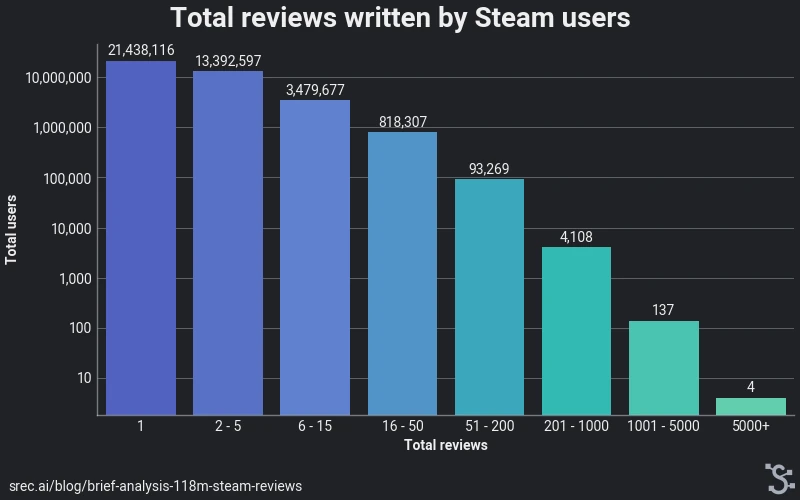
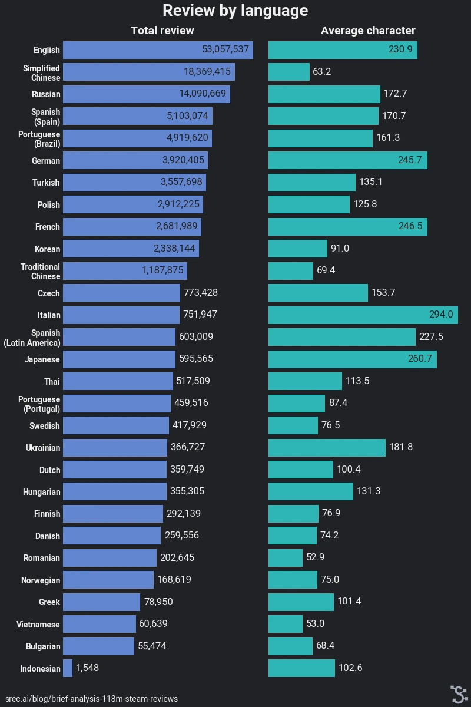
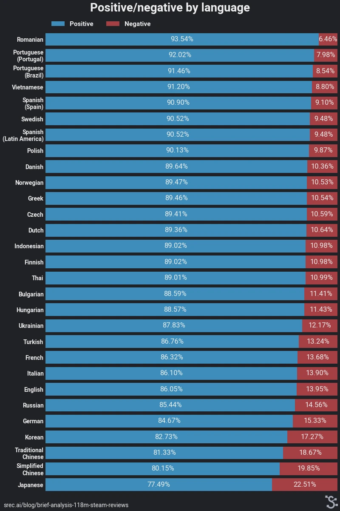
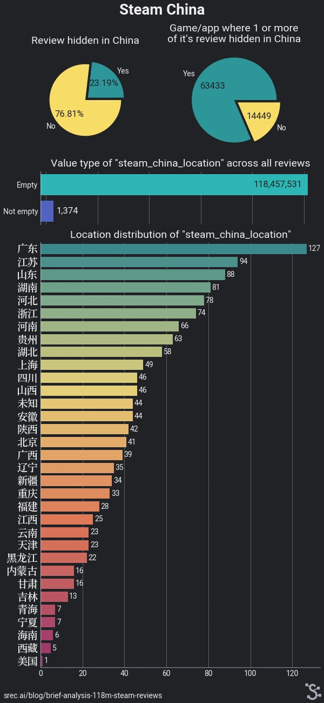

# Brief analysis of 118 million Steam Reviews

| Original blog link | https://srec.ai/blog/brief-analysis-118m-steam-reviews                                                |
| ------------------ | ----------------------------------------------------------------------------------------------------- |
| Description        | A short analysis of Steam Review based on SRec database snapshot which was taken on 27 November 2023. |
| Published time     | 13 December 2023                                                                                      |
| Modified time      | 15 December 2023                                                                                      |
| Section            | Steam                                                                                                 |
| Tags               | Steam Reviews, Data analytic, Statistic                                                               |

**Notice:** If you use mobile device, I **recommend** you rotate it to a horizontal position.

Steam remains the most popular distribution platform for PC games. Among all its community features, Steam Reviews might be both very popular and controversial. And even though there are other distributor platforms where you can get opinions from gamers, Steam is probably the most accessible option if you want to know what average players think, especially when it comes to less popular games.

> Table 1. Feedback feature on different distributor platforms for PC Games

| Platform        | Feedback feature | Additional information                                                                                                                                           |
| --------------- | ---------------- | ---------------------------------------------------------------------------------------------------------------------------------------------------------------- |
| GOG             | Rating Review    | Anyone can leave a rating and review. There are overall ratings for all and only verified owners. You can filter to see reviews written only by verified owners. |
| Itch.io         | Rating Comment   | Comment available if enabled by developer. User reviews only can be seen by developer.                                                                           |
| Epic Store      | Rating Poll      | Pool question is about various aspects of the game. Random players who play the game are asked to give a rating or poll.                                         |
| Microsoft Store | Rating Review    | Rating and review come from users across all devices/platforms.                                                                                                  |

There are some articles, blog posts, and research analyzing Steam Reviews, but most of them were either written some years ago, looked at a small number of reviews or focused on popular titles. Hence I decided to write this post. This blog post gives a quick look at 118 million Steam reviews.

## Table of contents

- [Table of contents](#table-of-contents)
- [Overview](#overview)
- [Playtime duration at review](#playtime-duration-at-review)
- [Time distribution](#time-distribution)
- [Additional analysis for review posted from 21-29 Nov 2022](#additional-analysis-for-review-posted-from-21-29-nov-2022)
- [Total reviews per user](#total-reviews-per-user)
- [Statistic by language](#statistic-by-language)
- [Steam China](#steam-china)
- [Next step](#next-step)
- [References](#references)

## Overview

The source for the 118,458,905 Steam reviews comes from a snapshot of the SRec database, which was taken on 27 November 2023. These are reviews for games and applications available on the Steam platform. Even though it sounds like a lot, SRec doesn't have complete reviews. SRec only collects reviews at certain intervals and doesn't include reviews for most games that were removed from Steam for various reasons including being a "fake" game or publisher of that game was "abusing" Steamworks.

Steam users are 5.9 times more likely to post positive reviews than negative ones, where about 2 of 3 reviewed games and apps bought directly from Steam. Non-Steam purchases refer to key activation, which can come from developers, publishers, key retailers (e.g. Humble Bundle and Green Man Gaming), or even key resellers (where anyone can sell keys) which have been involved in some controversies. There are 77,882 games and apps with at least one review and a total of 39,226,215 Steam users who have posted at least one review.

## Playtime duration at review

From 118 million Steam reviews, Steam users have a median of playing for 16.5 hours before posting their reviews. This means half of all reviews were posted within 16.5h or less. It's important to note that "median" is not the same as "average" where the average playtime is about 140 hours, which is influenced by people who posted their reviews after playing multiplayer or endless games for a very long duration.

When I looked closer at how long Steam users played before posting their reviews, there were several interesting findings:
* Very few reviews have playtime less than 5 minutes. It's interesting since Steam requires a minimum of 5 minutes of playtime before posting a review.
* Above 700 thousand reviews were posted as soon as Steam allowed it.
* There seems to be a peak in reviews around the 3-hour mark of playtime, but I don't know why this happens.
* Few people wait until they have played for about 1000 hours before posting their review, and this pattern also appears at other milestone hours at 2000, 3000, 4000 and 5000 hours.

## Time distribution

The image above is accurate (I've checked it manually). Since 2016, spikes in total reviews have happened in every late November, which coincides with Thanksgiving in the US and Brazil. In the middle of 2019, the biggest spike in total reviews was seen. It happened during the Steam Summer Sale 2019 when an additional event "Steam Grand Prix" was hosted where Steam users could win **free games**. Lastly, there's been a permanent increase in total reviews per day since the COVID-19 pandemic started.

If you wish to see a more detailed time distribution, check [this image](./img/analysis-p1-5_huge.webp) which has a 16000x1200 resolution.

## Additional analysis for review posted from 21-29 Nov 2022

In previous sections, it was shown that there have been spikes in total reviews in every late November since 2016. To learn more about this, I looked at the reviews posted from **21 November 2022 00:00:00 to 29 November 2022 23:59:59**. This date period was chosen since it's when total reviews per day went up.

> Table 2. Total reviews posted from 21-29 Nov 2022 split into 4 different release date periods

| Release date period | Total reviews | %      |
| ------------------- | ------------- | ------ |
| < 2022              | 730,793       | 53.60% |
| Jan-Oct 2022        | 527,937       | 38.72% |
| 01-29 Nov 2022      | 52,505        | 3.86%  |
| > 29 Nov 2022       | 52,222        | 3.83%  |
| Total               | 1,363,457     |        |

I then grouped total reviews by game/app release date period, but there's no indication that this increase happens because developers or publishers release their games at the end of the year. About total reviews for games & apps with a release date period after 29 Nov 22, it means those are reviews for **former** early access games that took off after 29 Nov 2022.

> Table 3. Language distribution of reviews posted from 21-29 Nov 2022

| Language            | Total reviews | %      |
| ------------------- | ------------- | ------ |
| English             | 503,474       | 36.93% |
| Simplified Chinese  | 258,421       | 20.93% |
| Russian             | 224,150       | 16.44% |
| Portuguese (Brazil) | 64,025        | 4.70%  |
| Spanish (Spain)     | 62,732        | 4.60%  |
| Turkish             | 48,170        | 3.53%  |
| German              | 39,603        | 2.90%  |
| Polish              | 38,595        | 2.83%  |
| French              | 20,880        | 1.53%  |
| Korean              | 15,974        | 1.17%  |
| Traditional Chinese | 15,196        | 1.11%  |
| Other languages     | 73,681        | 5.40%  |

Next, I decided to categorize reviews based on language. However, there wasn't a strong indication between the distribution and Thanksgiving holiday. I said that since it roughly matches the distribution of all 118M reviews which is shown in the next section.

Show or hide top 10 most reviewed games based on different release date periods

> Table 4. Most reviewed games posted from 21-29 Nov 2022 which were released before 2022

| Title                     | Release date | Total reviews |
| ------------------------- | ------------ | ------------- |
| Dota 2                    | 2013-07-09   | 19925         |
| Counter-Strike 2          | 2012-08-21   | 19,807        |
| Team Fortress 2           | 2007-10-10   | 12,035        |
| Left 4 Dead 2             | 2009-11-16   | 10,599        |
| Deep Rock Galactic        | 2020-05-13   | 10,562        |
| PUBG: BATTLEGROUNDS       | 2017-12-21   | 10,235        |
| The Witcher® 3: Wild Hunt | 2015-05-18   | 9,248         |
| Red Dead Redemption 2     | 2019-12-05   | 9,115         |
| Cyberpunk 2077            | 2020-12-09   | 8,878         |
| The Forest                | 2018-04-30   | 8,627         |

> Table 5. Most reviewed games posted from 21-29 Nov 2022 which were released on Jan-Oct 2022

| Title                        | Release date | Total reviews |
| ---------------------------- | ------------ | ------------- |
| Call of Duty®                | 2022-10-27   | 85,361        |
| ELDEN RING                   | 2022-02-24   | 40,888        |
| Vampire Survivors            | 2022-10-20   | 30,376        |
| Raft                         | 2022-06-20   | 24,181        |
| Stray                        | 2022-07-19   | 15,129        |
| God of War                   | 2022-01-14   | 9,523         |
| MultiVersus                  | 2022-07-19   | 9,258         |
| Dying Light 2 Stay Human     | 2022-02-03   | 7,856         |
| Mount & Blade II: Bannerlord | 2022-10-25   | 7,249         |
| MONSTER HUNTER RISE          | 2022-01-12   | 6,695         |

> Table 6. Most reviewed games posted from 21-29 Nov 2022 which were released on 01-29 Nov 2022

| Title                              | Release date | Total reviews |
| ---------------------------------- | ------------ | ------------- |
| Call of Duty®: Warzone™            | 2022-11-16   | 4,608         |
| Nobody - The Turnaround            | 2022-11-16   | 4,362         |
| Marvel’s Spider-Man: Miles Morales | 2022-11-18   | 3,947         |
| The Past Within                    | 2022-11-02   | 2,584         |
| Evil West                          | 2022-11-21   | 2,327         |
| Sonic Frontiers                    | 2022-11-07   | 2,297         |
| Soulstone Survivors                | 2022-11-07   | 2,276         |
| ZERO Sievert                       | 2022-11-15   | 2,037         |
| 《蜀山：初章》买断版               | 2022-11-17   | 1,992         |
| Bendy and the Dark Revival         | 2022-11-15   | 1,887         |

> Table 7. Most reviewed games posted from 21-29 Nov 2022 which were released after 29 Nov 2022

| Title                      | Release date | Total reviews |
| -------------------------- | ------------ | ------------- |
| Warhammer 40,000: Darktide | 2022-11-30   | 15,899        |
| Brotato                    | 2023-06-23   | 7,465         |
| MARVEL SNAP                | 2023-08-22   | 3,095         |
| 20 Minutes Till Dawn       | 2023-06-08   | 2,599         |
| Omega Strikers             | 2023-04-27   | 1,810         |
| DAVE THE DIVER             | 2023-06-28   | 1,472         |
| Barotrauma                 | 2023-03-13   | 1,218         |
| Aimlabs                    | 2023-06-16   | 1,172         |
| VillageRhapsody            | 2023-04-26   | 988           |
| My Time at Sandrock        | 2023-11-02   | 824           |

Lastly, I show the top 10 most reviewed games based on 4 different date periods. Although nothing interesting here since it's dominated by popular games and only Call of Duty® received far higher reviews than other popular games.

## Total reviews per user

In the previous section, I mentioned that 39,2M Steam users have posted at least one review. Out of these users, 54.7% have only posted one review so far, while a huge majority (97.7%) have posted 15 or fewer reviews in total. On the other hand, there are 4 exceptional users who have posted more than 5,000 reviews. One of these users has even surpassed 10,000 reviews! But don't forget that this only includes reviews for games and apps, which doesn't include reviews for DLC, soundtracks or other type of content.

## Statistic by language

In this section, I show statistics by language. As expected, English is the most common language for writing reviews on Steam. However, since Steam doesn't have an "Other" language option, I expect that actual reviews posted in English are lower than 53 million. On the other hand, it's surprising to see that the Indonesian language has only 1,548 reviews even though Indonesia has a population of ~278 million people and Steam has added Indonesian as a language option on 12 September 2023.

To get an accurate average character per language, I removed all valid BBcode from the reviews beforehand. The English reviews have more characters than expected since I often see people write short joke or statement (e.g. "good game" and "this is fun game"). Japanese reviews have a lot more characters on average compared to Chinese and Korean even though all of them pose some similarities.

Finally, I show the distribution of positive/negative reviews per language. Japanese reviews stands out again with the lowest rate of positive review followed by reviews written in Chinese and Korean which those usually spoken in Asia. Meanwhile, Romanian reviews have a 16.05% higher rate of positive reviews compared with Japanese reviews. Lastly, languages with high positive reviews seem to be associated with language which is usually spoken in Europe or used in regions where Steam suggest lower base game price. 

## Steam China

While this information isn't mentioned in Steamworks documentation, the API provided by Valve includes two additional keys/columns for each review. The first key/column indicates whether a review is hidden in China, with 23.19% of reviews being hidden there. The second key/column is called "steam_china_location". I don't know exactly what it means and only 1,394 reviews (0.00116%) have non-empty values.

## Next step

In this blog post, I've looked at Steam reviews from various angles. I examined review activity around late November 2022, as well as the distribution of languages used for writing reviews. My analysis has revealed few interesting patterns about when users are most likely to leave Steam reviews along with the general characteristics of their reviews.

In my next blog post, I'll dive deeper into Steam Reviews which use English language. It includes comparisons between positive/negative reviews, free/paid games, Indie/non-Indie games, singleplayer/multiplayer games and other dimensions. 

## References

1. [User Reviews - Get List (Steamworks Documentation)](https://partner.steamgames.com/doc/store/getreviews)
2. [Summer Sale featuring the Steam Grand Prix 2019 has begun! - Steam News](https://steamcommunity.com/games/593110/announcements/detail/1616144864293404894)
3. [Indonesian now fully supported on Steam - Steam News](https://store.steampowered.com/news/app/593110/view/3651911507665869005)
4. [Valve removed 1000 games from Steam because publishers were 'abusing' Steamworks | PC Gamer](https://www.pcgamer.com/1000-games-were-just-removed-from-steam-and-we-dont-know-why/)
5. [Valve removes over 150 'fake' games from Steam | Eurogamer.net](https://www.eurogamer.net/valve-removes-over-150-fake-games-from-steam)
6. [The Epic Games Store "Ratings and Polls" update - Epic Games Store](https://store.epicgames.com/en-US/news/the-epic-games-store-ratings-and-polls-update)
7. [Rules and Guidelines for GOG Reviews - GOG SUPPORT CENTER](https://support.gog.com/hc/en-us/articles/360010188177-Rules-and-Guidelines-for-GOG-Reviews)
8. [Interacting with your fans - itch.io](https://itch.io/docs/creators/interact)
9. [How to Read User Reviews - Questions & Support - itch.io](https://itch.io/t/1802055/how-to-read-user-reviews)
10. [Chinese vs Japanese vs Korean Languages: Similarities & Differences - Milestone Localization](https://www.milestoneloc.com/chinese-vs-japanese-vs-korean/)
