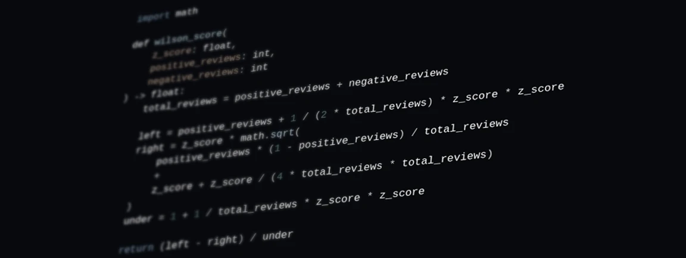

# Introducing Top Hidden Gems

| Original blog link | https://srec.ai/blog/introducing-top-hidden-gems                                                     |
| ------------------ | ---------------------------------------------------------------------------------------------------- |
| Description        | Introducing the Top Hidden Gems feature to discover top-rated games that have flown under the radar. |
| Published time     | 29 August 2024                                                                                       |
| Modified time      | 30 August 2024                                                                                       |
| Section            | Steam                                                                                                |
| Tags               | Ranking Algorithm, Hidden Gems, Steam                                                                |

As an enthusiast of story-driven games, I'm always on the lookout for new and unique experiences. But many decent or unique story-driven games are lost in the vastness of over 100,000 Steam games. That's why I've created the Hidden Gems feature.

## Table of contents

- [Table of contents](#table-of-contents)
- [What is Hidden Gems?](#what-is-hidden-gems)
- [The Math Behind Hidden Gems](#the-math-behind-hidden-gems)
- [Technical limitation](#technical-limitation)
- [Wrapping Up](#wrapping-up)
- [References](#references)

## What is Hidden Gems?

Hidden Gems refers to lesser-known titles that offer a unique or high-quality gaming experience. These games may not have been widely marketed or overshadowed by more popular titles. If you're looking for something different, you might stumble upon them.

The Hidden Gems feature on SRec uses a ranking algorithm to discover such games. By using reviews' rating and and total review count, I can identify some of these hidden gems. To make discovery even easier, I've categorized these games by their tags into six distinct categories. This way, you can quickly find games that match your specific interests or preferences.

## The Math Behind Hidden Gems

I built this ranking algorithm based on Wok's superb work, which provides a robust and fast way to rank games. This algorithm combines two key components:

* **Wilson Score** is a statistical approach to measuring the accuracy of ratings for a game. It means a game with few ratings, even if they're all positive, will have lower score. For example, a game with 100% positive ratings and few reviews will have a lower score than a game with 90% positive ratings and hundreds of reviews.
* **Decreasing Function** is designed to find 'hidden' or 'less-known' games. The function `alpha / (alpha + total_reviews)` considers total reviews for each game. It gives a lower score to highly popular titles, such as Portal 2.

By combining these two components in the ranking algorithm, I can provide better list of hidden gems that are truly worth exploring. But before performing ranking, I use two key criteria to filter out games:

* **Tag ratio and position filter**. I only include games that have a certain ratio and position of their Steam tag(s) matching the category you're browsing. For example, if you're looking for emotional games under narrative category, I'll exclude games with low ratios or positions of chosen tag(s). This ensures the algorithm is more relevant to your specific interests.
* **Review language threshold**. I require each game to have at least three English or non-English reviews. This helps me exclude games that only attract a specific speaker group (only English speakers or non-English speakers).

## Technical limitation

While I'm mostly satisfied with the ranking algorithm, there are some technical limitations you should be aware of:

1. **Alpha Values** used in the decreasing function which represent total reviews, which must be picked manually. There's no known solid approach to choosing this value, so I decided to choose value based on the top 2% of total reviews among all games with at least one review.
2. **Tagging Errors**. People may tag games inaccurately, which can cause the algorithm to show irrelevant games.
3. **Manipulation of Reviews**. Developers and publishers might obtain high ratings for their games by conducting free giveaways or paying someone to write positive reviews. While I could only consider reviews from users who bought the game on Steam, it would exclude some great games where such trade-offs aren't acceptable for me.
4. **Total reviews**. Games with zero or very few reviews are unable to enter the list, as the Wilson score gives higher scores when there are more people writing reviews.

## Wrapping Up

You can now use the Top Hidden Gems feature using [this link](https://srec.ai/hidden-gems) or clicking "Hidden Gems" on the navigation bar, then choosing category and tag(s) that match your preferences. I hope you'll discover some new games that will surprise and delight you. You might even stumble upon a game that becomes one of your all-time favorites! And since I've been using this feature myself, I should admit that my Steam wishlist has grown even bigger!

## References

1. [woctezuma/hidden-gems: Ranking of Steam games which favors "hidden gems". Featured in PC Gamer.](https://github.com/woctezuma/hidden-gems)
2. [Valve still trying to stop Steam user review manipulation | Rock Paper Shotgun](https://www.rockpapershotgun.com/valve-still-trying-to-stop-steam-user-review-manipulation)
3. [Steam’s user-defined tags and a problem - indiecator](https://indiecator.org/2021/02/02/steams-user-defined-tags-and-a-problem/)
