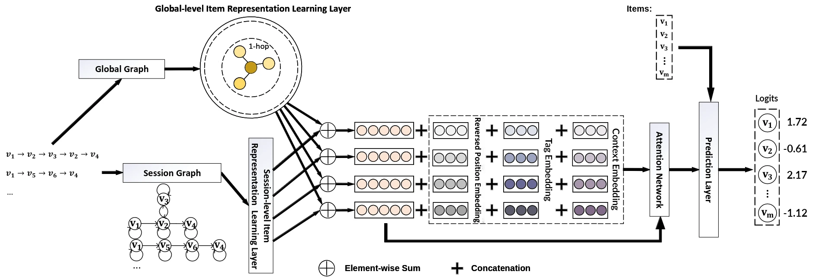

# Technical detail of SRec Smart recommender

| Original blog link | https://srec.ai/blog/srec-gcegnn                                         |
| ------------------ | ------------------------------------------------------------------------ |
| Description        | Short explanation about SRec Smart recommender which is based on GCE-GNN |
| Published time     | 9 October 2023                                                           |
| Section            | Machine Learning                                                         |
| Tags               | Recommender System, GCE-GNN, Deep Learning                               |



Welcome to the first SRec blog post. I'll talk about GCE-GNN modification and integration on SRec. I assume you have basic familiarity with Recommender Systems, Machine Learning and briefly read about GCE-GNN (if you haven't, scroll down to the references section and read the paper).

## Why GCE-GNN

While there are more popular sequential recommenders (such as NARM, SR-GNN, BERT4Rec and SASRec), these are the main reasons I choose GCE-GNN,

1. User-free model, but utilize other user's sequence during prediction. By user-free model, I mean the model doesn't use user ID/representation on prediction. It's a required feature for SRec recommender system since all visitor is anonymous. 
2. Authors of GCE-GNN provide source code of the model. This saves some time to re-implement GCE-GNN or verify different GCE-GNN implementations (such as RecBole-GNN) by myself.
3. GCE-GNN model architecture/framework is relatively easy to understand.

Although just like most sequential recommender models, GCE-GNN doesn't utilize negative interaction/feedback which could improve performance of the recommendation model.

## GCE-GNN modification

As seen on the first image of this blog post, it's an overview of modified GCE-GNN for SRec recommender system. **[Click here for the full-resolution image](./img/srec-gcegnn.webp)**. 1-hop is chosen since I expect sequences from user reviews to be noisy. 2 additional embeddings were also added as extra information to enhance recommendation performance. Lastly, based on the GCE-GNN source code, the model produces raw logits output (rather than value between 0 and 1).

## Dataset

To train modified GCE-GNN, I created a dataset based on >110M reviews on SRec database along with Steam games's metadata. To perform preprocessing, I roughly follow preprocessing based on GCE-GNN paper. More specifically, I remove users who write less than 3 positive reviews and games which have less than 5 positive reviews. I also set last 2 weeks from most recently created review for test data and the remaining historical reviews for training data. In addition, users who only or usually write reviews for popular games are also excluded. Contrary to some expectations, this slightly improves evaluation results while massively reduces training time.

> Table 1. Statistic of processed dataset

| **Label**    | **Quantity** |
| ------------ | ------------ |
| Users        | 634,575      |
| Items        | 42,429       |
| Interactions | 13,520,506   |
| Avg. length  | 21.24        |


To preprocess Steam game's metadata, there are 2 things I do. For game tags, I create a matrix that represents Steam game and its game tags, where its value is based on value/weight of each game tags. Since total game tags and dimension of GCE-GNN embedding is different, I perform dimensional reduction on that matrix. NMF/NNMF is chosen since value/weight of the game tag is always positive. As for other game metadata, I perform mapping between game id and each context which is used on learnable context embedding.

## Inference speed

While quantization and pruning are common ways to improve inference speed, SRec use neither. Pruning was never tried due to very few research about pruning on sequential recommender model. As for quantization, I've tried both dynamic quantization and Post-training Static quantization (PTQ) with 8-bit precision following PyTorch blog and documentation. Unfortunately, the performance isn't satisfying enough where the order of recommended games is considerably different (e.g. item at 1st position moved to 4th position). One possible cause is the model has low parameter count (when all embedding layers are excluded) at ~1.1M parameters.

```py
import torch
import intel_extension_for_pytorch as ipex

model = ...
example_inputs = ...

with torch.no_grad():
    model_ipex = ipex.optimize(model, dtype=torch.float32, conv_bn_folding=False, linear_bn_folding=False)
    model_ipex = torch.jit.trace(model_ipex, example_inputs=example_inputs)
    model_ipex = torch.jit.freeze(model_ipex)
```

However, I use TorchScript and Intel Extension for PyTorch (IPEX) as another way to improve inference speed which is very easy to use (see code snippet above). If you're familiar with IPEX or Intel products, you might wonder why I don't use `torch.bfloat16` instead. The reason is both CPU on my device and server hosting doesn't support bfloat16. To check whether there's inference speed improvement, i perform a short benchmark with following details:
* AMD Ryzen 5 1600.
* Using 1 thread by setting `torch.set_num_threads(1)` and `torch.set_num_interop_threads(1)`.
* Batch size 1.
* 10K inputs as benchmark dataset, where each input is generated from 1-5 random Steam game appid(s).
* Both models were fed with 1K inputs as warmup before starting the benchmark.

> Table 2. Inference benchmark result

|                    | **Total duration** | **Throughput** |
| ------------------ | ------------------ | -------------- |
| PyTorch            | 31.891s            | 313.6 inputs/s |
| TorchScript        | 28.263s            | 353.8 inputs/s |
| TorchScript + IPEX | 28.043s            | 356.6 inputs/s |

Based on above benchmark result (which ran 3 times), TorchScript and IPEX improve inference speed by 12.07% to 356.6 inputs/second. But take note this benchmark excludes time to preprocess input data and postprocess model output to get top-k recommended games. Although since the service hosting I use **does not support** AVX2 instruction, I had to abandon IPEX. Lastly, I use TorchServe for deployment purposes.

## What next?

While GCE-GNN works well enough as SRec recommender system, unfortunately, it provides less stable prediction compared to SRec recommender based on game tags. There are other improvements that could be made such as more sophisticated quantization methods and better dataset preprocessing. In the future, GCE-GNN will be replaced with a more performant sequential recommender. Any feedback is appreciated.

## References

1. [Global Context Enhanced Graph Neural Networks for Session-based Recommendation (ACM)](https://dl.acm.org/doi/abs/10.1145/3397271.3401142)
2. [Global Context Enhanced Graph Neural Networks for Session-based Recommendation (arXiv)](https://arxiv.org/abs/2106.05081)
3. [CCIIPLab/GCE-GNN: The source code for "Global Context Enhanced Graph Neural Network for Session-based Recommendation".](https://github.com/CCIIPLab/GCE-GNN)
4. [Intel® Extension for PyTorch - Examples](https://intel.github.io/intel-extension-for-pytorch/cpu/latest/tutorials/examples.html)
5. [Practical Quantization in PyTorch](https://pytorch.org/blog/quantization-in-practice/)
