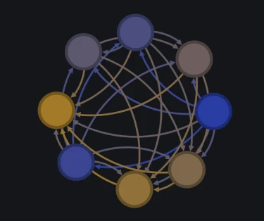

# Steam Review aspect dataset

| Original blog link | https://srec.ai/blog/steam-review-aspect-dataset                             |
| ------------------ | ---------------------------------------------------------------------------- |
| Description        | Introducing Steam Review aspect dataset for multi-label classification task. |
| Published time     | 28 May 2024                                                                  |
| Modified time      | 11 June 2024                                                                 |
| Section            | Machine Learning                                                             |
| Tags               | Dataset, Machine Learning, Steam Review                                      |



Steam Review aspect dataset is a dataset of Steam Review with 8 review aspects. This dataset contains 1100 English Steam reviews, split into 900 train and 200 test. This dataset was initially created to identify which aspects are mentioned in English reviews as part of [Analysis of 43 million English Steam Reviews](https://srec.ai/blog/analysis-43m-english-steam-reviews).

## Table of contents

- [Table of contents](#table-of-contents)
- [Data collection and annotation](#data-collection-and-annotation)
- [Data format](#data-format)
- [Model benchmark](#model-benchmark)
- [Download](#download)
- [Citation](#citation)
- [License](#license)
- [Appendix A - Statistic](#appendix-a---statistic)
- [Appendix B - Full model benchmark](#appendix-b---full-model-benchmark)

## Data collection and annotation

The source of the reviews comes from a snapshot of the SRec database, which was taken on 21 February 2024. SRec obtain all reviews for all games and mods using [API provided by Steam](https://partner.steamgames.com/doc/store/getreviews). To reduce bias when selecting reviews to be annotated, I chose reviews primarily based on these criteria,

* Character length.
* Helpfulness score.
* Popularity of the reviewed game.
* Genre or category of the reviewed game.

There are 8 aspects to define review in this dataset. I am the only annotator for this dataset. A review is deemed to contain a certain aspect, even if it's mentioned implicitly (e.g., "but it'd be great if there's good looking characters...") or only mention lack of the aspect (e.g., "... essentially has no story ..."). The below table shows 8 aspects of this dataset, along with a short description and example.

> Table 1. A description and example for 8 aspects in this dataset

| Aspect      | Short description                                                                                                     | Review text                                                                                                                    |
| ----------- | --------------------------------------------------------------------------------------------------------------------- | ------------------------------------------------------------------------------------------------------------------------------ |
| Recommended | Whether the reviewer recommends the game or not. This aspect comes from the one who wrote the review.                 | ... In conclusion, good game                                                                                                   |
| Story       | Story, character, lore, world-building and other storytelling elements.                                               | Excellent game, but has an awful-abrupt ending that comes out of nowhere and doesnt make sense ...                             |
| Gameplay    | Controls, mechanics, interactivity, difficulty and other gameplay setups.                                             | Gone are the days of mindless building and fun. Power grids? Taxes? Intense accounting and counter-intuitive path building ... |
| Visual      | Aesthetic, art style, animation, visual effects and other visual elements.                                            | Gorgeous graphics + 80s/90s anime artstyle + Spooky + Atmospheric ...                                                          |
| Audio       | Sound design, music, voice acting and other auditory elements.                                                        | ... catchy music, wonderful narrator saying very kind words ...                                                                |
| Technical   | The technical aspects of the game such as bug, performance, OS support, controller support and overall functionality. | bad doesnt fit a 1080p monitor u bastard ...                                                                                   |
| Price       | Price of the game or its additional content.                                                                          | Devs are on meth pricing this game at $44                                                                                      |
| Suggestion  | Suggestions for the state of the game, including external factors such as game\'s price or publisher partnership.     | ... but needs a bit of personal effort to optimize the controls for PC, otherwise ...                                          |

Take note that few reviews contain language and content that some people may find offensive, discriminatory, or inappropriate. I **DO NOT** endorse, condone or promote any of such language and content.

## Data format

CSV, JSON and Apache Arrow file formats are provided for convenience's sake. You can check the notebook on `example` directory for a bare-minimum example of how to open those files. Both raw and cleaned review text are provided. Cleaned review text was preprocessed by stripping BBcode, reducing excessive whitespaces and reducing excessive newlines.

## Model benchmark

Model benchmark on Steam Review aspect dataset split into 3 categories,

* Base: Non-attention based language model.
* Embedding: Inspired by MTEB, obtained embedding trained on Logistic Regressor for up to 100 epochs.
* Fine-tune.

There are 15 models benchmarked, where few of the same base models are used multiple times using different methods. You can see Appendix B for the result and visit GitHub to see its source code.

## Download

You can download Steam review aspect dataset from one of these sources,

* [GitHub](https://github.com/ilos-vigil/steam-review-aspect-dataset)
* [Huggingface](https://huggingface.co/datasets/ilos-vigil/steam-review-aspect-dataset)
* [Kaggle](https://www.kaggle.com/datasets/ilosvigil/steam-review-aspect-dataset)

## Citation

If you wish to use this dataset in your research or project, please cite this blog post: [Steam review aspect dataset](https://srec.ai/blog/steam-review-aspect-dataset) 

```
Sandy Khosasi. "Steam review aspect dataset". (2024).
```

For those who need it, a BibTeX citation format also has been prepared.

```bibtex
@misc{srec:steam-review-aspect-dataset,
	title        = {Steam review aspect dataset},
	author       = {Sandy Khosasi},
	year         = {2024},
	month        = {may},
	day          = {28},
	url          = {https://srec.ai/blog/steam-review-aspect-dataset},
    urldate      = {2024-05-28}
}
```

## License

Steam Review aspect dataset is licensed under [Creative Commons Attribution 4.0 International](https://creativecommons.org/licenses/by/4.0).

## Appendix A - Statistic

> Table 2. Total occurrence of each aspect

| Aspect      | Train | Test |
| ----------- | ----- | ---- |
| Recommended | 667   | 148  |
| Story       | 400   | 89   |
| Gameplay    | 693   | 154  |
| Visual      | 391   | 87   |
| Audio       | 227   | 51   |
| Technical   | 259   | 57   |
| Price       | 213   | 47   |
| Suggestion  | 97    | 21   |

> Table 3. Total aspect in a review

| Total aspect | Train | Test |
| ------------ | ----- | ---- |
| 0            | 1     | 7    |
| 1            | 88    | 11   |
| 2            | 214   | 43   |
| 3            | 218   | 55   |
| 4            | 184   | 49   |
| 5            | 140   | 21   |
| 6            | 46    | 8    |
| 7            | 7     | 5    |
| 8            | 2     | 1    |

> Table 4. Total review for each game in this dataset

| Total review for each game | Train | Test |
| -------------------------- | ----- | ---- |
| 1                          | 280   | 164  |
| 2                          | 301   | 18   |
| 3                          | 6     | 0    |

> Table 5. Statistics of total characters

|             | Train (review) | Train (cleaned review) | Test (review) | Test (cleaned review) |
| ----------- | -------------- | ---------------------- | ------------- | --------------------- |
| Q1          | 417            | 416.75                 | 390           | 390                   |
| Q2 (Median) | 871            | 867.5                  | 888           | 888                   |
| Q3          | 1810.5         | 1753.75                | 1629.75       | 1623.5                |
| Average     | 1408.49        | 1389.06                | 1286.12       | 1267.96               |

## Appendix B - Full model benchmark

> Table 6. Benchmark result for base model

| Model              | Macro precision | Macro recall | Macro F1 | Note                                                                         |
| ------------------ | --------------- | ------------ | -------- | ---------------------------------------------------------------------------- |
| Spacy Bag of Words | 0.6203          | 0.5391       | 0.5494   |                                                                              |
| FastText           | 0.6284          | 0.5713       | 0.5871   | Minimum text preprocessing, use pretrained vector                            |
| FastText           | 0.6933          | 0.5821       | 0.6027   | Minimum text preprocessing, choose hyperparameter based on K-5 fold autotune |
| Spacy Ensemble     | 0.6043          | 0.6773       | 0.6299   | Choose hyperparameter based on simple grid search                            |

> Table 7. Benchmark result for embedding model

| Model                                                     | Param | Max tokens | Macro precision | Macro recall | Macro F1 | Note                                 |
| --------------------------------------------------------- | ----- | ---------- | --------------- | ------------ | -------- | ------------------------------------ |
| sentence-transformers/all-mpnet-base-v2                   | 110M  | 514        | 0.7074          | 0.5431       | 0.5853   |                                      |
| jinaai/jina-embeddings-v2-small-en                        | 137M  | 8192       | 0.7068          | 0.6075       | 0.6437   |                                      |
| jinaai/jina-embeddings-v2-base-en                         | 137M  | 8192       | 0.6813          | 0.6501       | 0.6618   |                                      |
| Alibaba-NLP/gte-large-en-v1.5                             | 434M  | 8192       | 0.7001          | 0.6501       | 0.6729   |                                      |
| nomic-ai/nomic-embed-text-v1.5                            | 137M  | 8192       | 0.7075          | 0.6498       | 0.6756   |                                      |
| McGill-NLP/LLM2Vec-Mistral-7B-Instruct-v2-mntp-supervised | 7111M | 32768      | 0.7238          | 0.6697       | 0.6928   | NF4 double quantization, instruction |
| WhereIsAI/UAE-Large-V1                                    | 335M  | 512        | 0.7245          | 0.6718       | 0.6946   |                                      |
| mixedbread-ai/mxbai-embed-large-v1                        | 335M  | 512        | 0.7215          | 0.6817       | 0.6989   |                                      |
| intfloat/e5-mistral-7b-instruct                           | 7111M | 32768      | 0.7345          | 0.7000       | 0.7137   | NF4 double quantization, instruction |

> Table 8. Benchmark result for fine-tuned model

| Model                             | Param | Max tokens | Macro precision | Macro recall | Macro F1 | Note                                            |
| --------------------------------- | ----- | ---------- | --------------- | ------------ | -------- | ----------------------------------------------- |
| jinaai/jina-embeddings-v2-base-en | 137M  | 8192       | 0.7485          | 0.7257       | 0.7354   | Choose hyperparameter from Ray Tune (30 trials) |
| Alibaba-NLP/gte-large-en-v1.5     | 434M  | 8192       | 0.8403          | 0.8152       | 0.8231   | Choose hyperparameter from Ray Tune (16 trials) |
